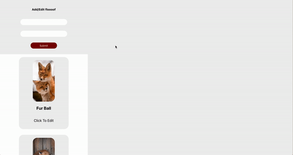

# Floof practice lab

## Instructions

1. Clone down the repo and run `npm install`
2. Clone down the backend from https://github.com/mazenswar/react-floof-lab-072619-backend and then:
   - `bundle install`
   - `rails db:create`
   - `rails db:migrate`
   - `rails db:seed`
3. Run your servers and get get down to business!

## Deliverables:

1. When you app loads, you should fetch all the `Foxes` from the api and render a `<Card />` for each `Fox` for in `<CardContainer />`.
2. A user should be able to click on a `<Card />` and see the clicked `Fox`'s information in `<ShowDetails />`.
3. `<Form />` should let the user BOTH create a new and edit a `Fox`.
   - If no `Fox` has been selected from the list, the user should be able to create a new one, using the form.
   - If a `Fox` was selected from the list, the form should be populated with information about that selected `Fox` and the used should be able to edit that `Fox`.

# NOTE

- Although `<ShowDetails />` is dynamically changing with user input, none of the changes are persisted unless the user submits the `<Form />`

## How your app should like by the end.

